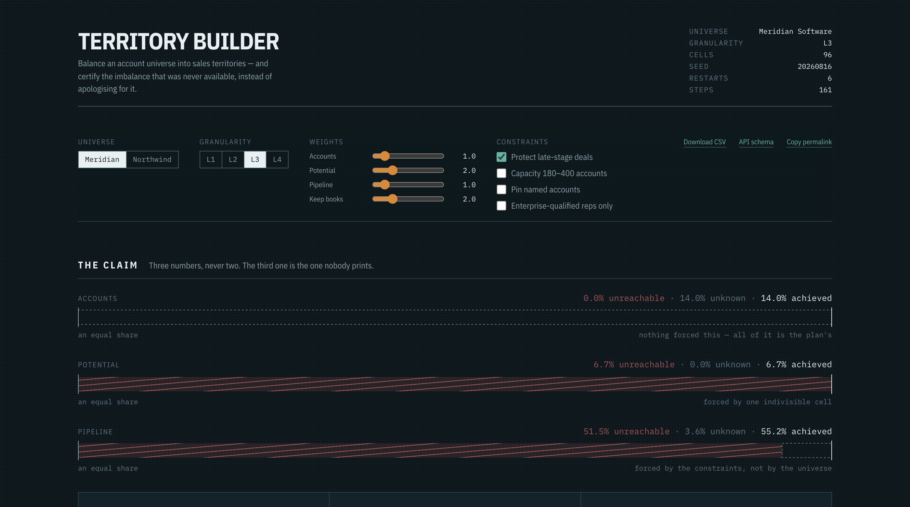
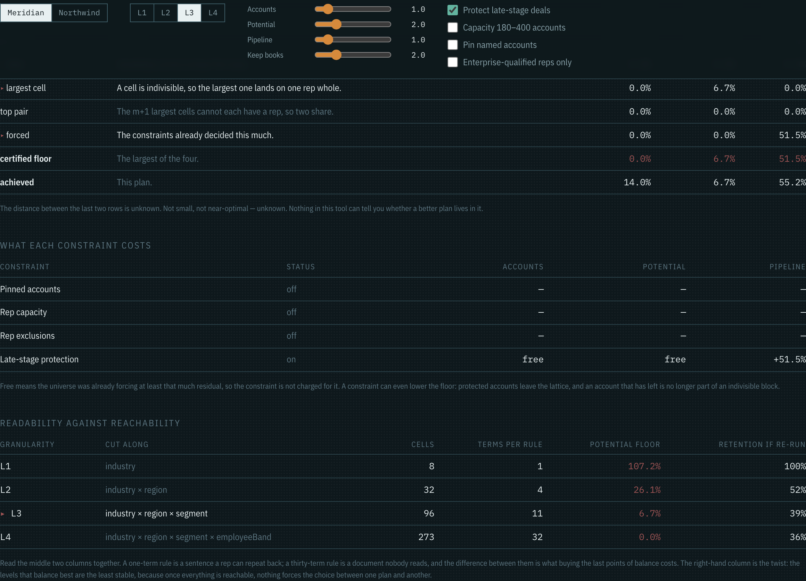
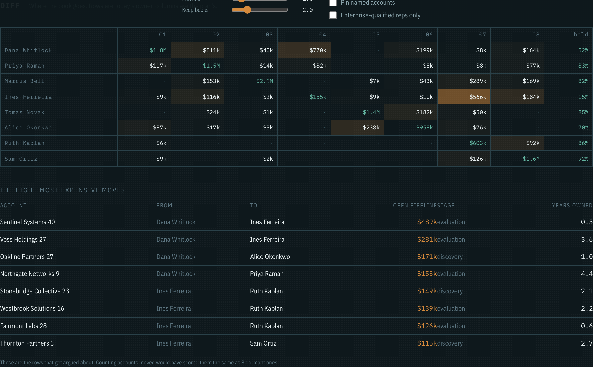
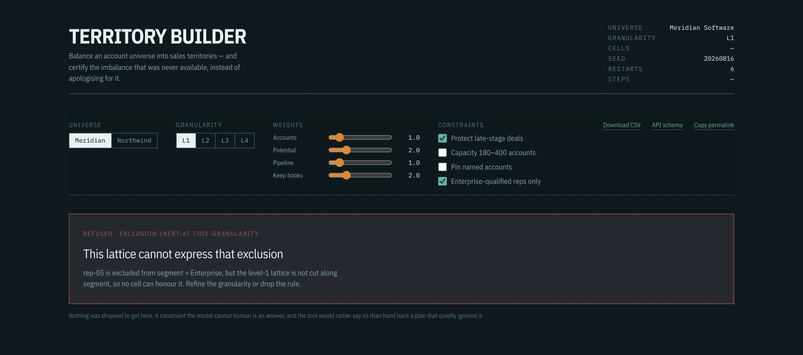
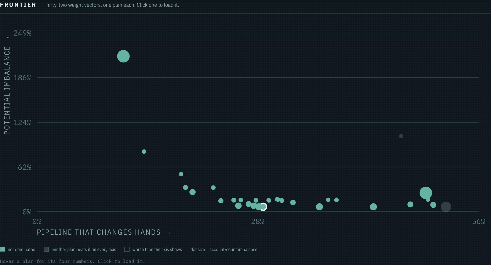

# Territory Builder

Balance an account universe into sales territories — and certify the imbalance that was **never available**, instead of apologising for it.

**[Live demo](https://territory-builder-akshat-tiwarix.vercel.app)** · [Plain-English guide](docs/plain-english-guide.md) · [`POST /api/v1/plan`](https://territory-builder-akshat-tiwarix.vercel.app/api/schema) · [Plan](./PLAN.md) · Day 016 of a 100-day building challenge



Opens on a 2,000-account universe with a plan already computed. No sign-up, no key, no upload.

> The corpus is synthetic, seeded, and committed, with eight named pathologies planted on purpose and asserted by tests. There are **zero model calls** — territory assignment is combinatorial, a language model would be worse at it and unverifiable besides, and every number here replays byte-identically from a seed.

## Why I Built This

Territory design is the highest-stakes recurring decision in go-to-market and it is made with the worst tooling of any decision at its level. Once a year somebody sorts the account list, cuts it into as many pieces as there are reps, and declares the result balanced. A slide says **±4%**. Half the sales floor believes it got robbed, and no artifact anywhere can tell them whether they did.

Four things are wrong with that number, and they compound.

**The plan is presented as an assignment when it is actually a change.** Nobody carves into a vacuum. Every account that moves takes a relationship someone spent two years building and a deal someone was about to close. The `±4%` says nothing about how much of that was destroyed to get there.

**Perfect balance is arithmetically impossible, and nobody says so.** Account universes are lumpy. One indivisible group can be large enough that *no* assignment reaches the target. Commercial tools never report this, which produces two failures at once: teams chase targets that were never reachable and burn churn doing it, and teams celebrate hitting targets that every possible carve would have hit. Both are the same missing number.

**Balance is measured on an estimate and reported as a fact.** You do not balance on revenue, you balance on *estimated potential*, which is a model output with error bars nobody prints.

**The objectives conflict and get collapsed into one score.** Equal count, equal potential, equal in-flight pipeline and low disruption cannot be maximised together. A single "balance score" has chosen the tradeoff for you and hidden the choice inside a weighted sum.

This repo's subject is those four gaps. The carve itself is the easy part — it runs in 80ms.

## What It Does

**Three numbers per axis, never two.** The certified floor, the plan achieved, and the gap between them **labelled unknown**. On the demo corpus at the default granularity, potential imbalance lands on **6.7% against a floor of 6.7%** — the residual is entirely the universe's lumpiness and there is nothing left to optimize. Pipeline lands on **55.2% against a floor of 51.5%**, and that floor is not the universe's fault at all: it is the late-stage protection rule, and the tool charges it by name.

**The diff is the product.** Churn is priced in **open pipeline dollars that change owner mid-flight** — $4.47M across 1,337 accounts on the default plan — never in accounts moved. Moving four hundred dormant accounts is nearly free; moving one account with a live negotiation is not, and a metric that scores those the same is why territory plans get overruled in the room.

**Every territory is a rule, not a list of IDs.** The decision variable is a *cell* in the dimension lattice, assigned whole, so a rule falls out by construction — and rendering a rule, evaluating it back against the universe, and getting exactly that territory's account set is a tested invariant rather than a hope.

**The claim is reported as an interval.** Wobble the potential estimates inside their own stated error bands and the same plan reads anywhere from **4.4% to 14.0%**. Re-optimize under those wobbles and only **39% of accounts keep their owner**.

## Demo

### The floor that was never available



Four lower bounds, all arithmetic, none of them from a search. The binding one is named, because *why* the residual exists is more actionable than its size: `largest cell` means the universe is lumpy, `forced` means you did this to yourself.

The granularity table is the second thing this tool exists to show:

| level | cut along | cells | terms per rule | potential floor | retention if re-run |
|---|---|---|---|---|---|
| L1 | industry | 8 | **1** | **107.2%** | 100% |
| L2 | + region | 32 | 4 | 26.1% | 52% |
| L3 | + segment | 96 | 11 | 6.7% | 39% |
| L4 | + employee band | 273 | **32** | **0.0%** | 36% |

A one-term rule is a sentence a rep can repeat back and costs 107 points of imbalance no optimizer can recover. A thirty-two-term rule reaches perfect balance and nobody can hold it in their head. **Neither end is correct**, and every tool I have seen picks one silently.

The right-hand column is the twist, and it was not in the plan — it fell out of building the perturbation analysis. **The levels that balance best are the least stable.** At L1 the plan is forced and 100% reproducible; at L4 everything is reachable, so nothing forces the choice between one plan and another, and re-running keeps 36% of owners. The sentence "this rep is overloaded" survives a re-draw of the estimates **59% of the time at L3 and 19% at L4**.

### Where the book actually goes



Rows are today's owner, columns are the plan's, cells are pipeline dollars. The `held` column is the share of each rep's in-flight pipeline that stays put.

Underneath: the eight most expensive individual moves, with stage and years owned. **These are the rows that get argued about**, and counting accounts moved would have scored them the same as eight dormant ones.

### The churn nobody chose

Building the optimizer turned up something the plan had assumed away. **The book on the ground is not expressible as a rule.** The legacy carve was cut by geography years ago and then split between two reps per region by nothing in particular, so at any granularity some cells contain accounts with different owners — and a cell goes to one rep.

So churn has a floor too. **11.1% of all open pipeline changes hands before the optimizer expresses a single preference.** Reporting a churn number without that beside it invites exactly the mistake the imbalance floor exists to prevent, so `lib/bounds/churn.ts` certifies it the same way.

### A constraint the model cannot honour



An exclusion names a dimension; a cell can only be restricted by a dimension the lattice contains. Ask for "rep-05 never sells Enterprise" at a granularity cut only by industry, and there is nothing to match on.

The first version of this code did the normal thing and ignored it. **The sweep caught 56 plans handing Enterprise accounts to reps forbidden from selling to them.** A silently dropped constraint is the failure this whole repo objects to, so the configuration is now refused by name, with the control to change.

### The frontier



Thirty-two weight vectors, one plan each, Pareto-filtered. The refusal to collapse the axes into a score is only useful if you can *see* the tradeoff — click a plan and the whole console loads it. The weight vector is a position on this picture, never a rating of it.

### The universe where balance was free

Switch to **Northwind** and the floor is `0.0%` at every level past the first. That does not mean the tool did well; it means nothing here was hard. It also means the plan is nearly arbitrary — re-running it keeps **30%** of owners. The console says both.

## How It Works

```
data/          seeded corpus + eight planted pathologies, committed as JSON
  ↓
lib/domain/    Account, Rep, Cell, Config, Plan — types and zod schemas
  ↓
lib/cells/     the lattice, four granularity levels, rule render + round-trip
  ↓
lib/measure/   axis loads, imbalance, three churn metrics
  ↓
lib/bounds/    four certified lower bounds — pure arithmetic, no search
  ↓
lib/optimize/  LPT seed, steepest-descent local search, multi-start
  ↓
lib/analysis/  Pareto frontier, perturbation intervals, plan stability
  ↓
app/           the console + POST /api/v1/plan
```

### Cells

The decision variable is not the account. The declared dimensions form a cross-product lattice, and each occupied **cell** is assigned whole to one rep. This buys three things at once: territories are readable rules by construction; the indivisibility of a cell turns the imbalance floor into arithmetic; and cell granularity becomes a visible, quantified tradeoff instead of an invisible one.

Pinned and protected accounts break cell atomicity, so they are lifted out as **explicit exceptions** and shown in the rule — `Manufacturing × West, plus Acme, minus Globex` — which is how a real territory document reads.

### The four bounds

| bound | statement | why it holds |
|---|---|---|
| `ideal` | `total / m` | pigeonhole — somebody carries at least the mean |
| `cell` | `max_c ( w(c) + min_{r eligible} committed_r )` | a cell is indivisible, so the largest lands whole on some eligible rep |
| `pair` | `w[m] + w[m+1]` | the `m+1` largest cells cannot each have a rep, so two share one |
| `forced` | committed load; `(Σw(C) + Σ_{r∈S} committed_r) / \|S\|`; `total − (m−1)·cap` | direct statements about what the constraints already decided |

`lib/bounds/` **may not import** `lib/optimize/`, and a test greps the directory to keep it that way. A bound that can see the search is a result, and reporting a result as a bound is the move this repo exists to refuse.

### The sweep

`npm run sweep` — 144 plans, 14,213 checks, 70 seconds, no network, [nine invariants](scripts/sweep.mts). It is not a slower `npm test`: invariants 1, 4 and 9 are cross-configuration properties that no single unit test can express, and they are the only things that catch a bound that is quietly wrong.

## Tradeoffs, and what is arbitrary

**The relationship-equity formula is made up.** `pipeline × tenureFactor × recencyFactor`, two years of ownership as full weight, a recent touch worth half again as much. The constants are arbitrary and are labelled arbitrary in the code, on screen and here. The claim is not that this formula is right — it is that scoring churn by account count is definitely wrong, and a weighting you can see and disagree with beats one you cannot.

**The optimizer has no optimality guarantee.** Multi-start local search, budgeted in iterations. It has a certified floor and a best-found plan, and the distance between them is printed and labelled unknown. It is never called near-optimal.

**Imbalance is max-side, which is blind to under-loaded reps.** On the default plan one rep holds **28 accounts** and a fifth of all potential — a perfectly correct answer to "balance potential", and a disaster in real life. The per-rep bars show it immediately and the capacity constraint fixes it, but the headline number does not catch it. That is a real limitation of the metric, not an oversight.

**The corpus is synthetic.** Every claim here is about the *shape* of a universe — lumpiness, forced residual, estimate sensitivity — and shape is not something a scrape teaches a reader more about; it would only add third-party claims that can be wrong. The generator is committed, the seed is fixed, and a test asserts the committed JSON is byte-identical to what the generator produces.

**Two invariants were restated during the build, against evidence**, and both restatements are recorded in the sweep source rather than only in git history. Invariant 3 assumed the status quo was reproducible; it is not cell-expressible at all. Invariant 4 assumed relaxing a constraint can never worsen the result; in a cell model it can, because pins and protection are the only account-level freedom the model has, and taking that escape hatch away cost 28 points of potential imbalance.

## Run it locally

```bash
npm install
npm run dev        # console at localhost:3000

npm test           # 67 unit tests, including the eight pathology assertions
npm run sweep      # nine invariants over a cross-product, no network
npm run typecheck
npm run build

npm run corpus     # regenerate the committed corpus (must be byte-identical)
npm run frontier   # recompute the committed frontier + stability artifacts (~97s)
```

No environment variables, no secrets, no runtime network calls.

## Repo map

| path | what lives there |
|---|---|
| [`PLAN.md`](./PLAN.md) | the contract — 26 decisions settled before any code was written |
| [`data/generate.ts`](./data/generate.ts) | the corpus, planted in named passes, one per pathology |
| [`lib/cells/rule.ts`](./lib/cells/rule.ts) | rule rendering, collapse, and the round-trip |
| [`lib/bounds/`](./lib/bounds/) | the four certified bounds and the churn floor ([notes](./lib/bounds/README.md)) |
| [`lib/optimize/search.ts`](./lib/optimize/search.ts) | LPT seed, local search, multi-start, determinism |
| [`scripts/sweep.mts`](./scripts/sweep.mts) | the nine invariants, and why two of them were restated |

## Licence

MIT.
